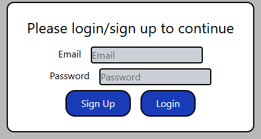
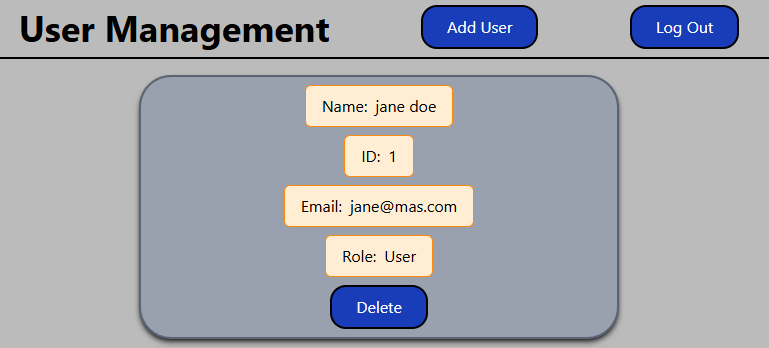

# Simple User Management App

Keep track of your users with ease using this site to track users with name, email, ID, and assigned role.

## Installation

- `npm i` to install dependencies.
- Add an .env connected to a supabase table

```sql
 CREATE TABLE IF NOT EXISTS users(
  id bigint GENERATED BY DEFAULT AS IDENTITY PRIMARY KEY,
  time_created timestamptz DEFAULT now(),
  email varchar(50) NOT NULL,
  first_name varchar(50) NOT NULL,
  last_name varchar(50) NOT NULL,
  role varchar(5) DEFAULT 'user' NOT NULL
);

-- seed data, remove if starting from scratch
INSERT INTO users(email, first_name, last_name, role)
VALUES ('jane@mas.com','jane','doe','user'), ('joe@mas.com','Joe','Smith','admin'), ('j.rell@gmail.com','Jeff','Rell','user'), ('kevin@gmail.com','Kevin','Rell','user'), ('g.amr@gmail.com','Gina','Tenna','admin'),('max@meo.net', 'Max', 'Meo','admin');

CREATE policy "Enable read access for authenticated users"
ON "public"."users"
AS PERMISSIVE
FOR SELECT
TO authenticated
USING (
  true
);

CREATE policy "Enable insert for authenticated users only"
ON "public"."users"
AS PERMISSIVE
FOR INSERT
TO authenticated
WITH CHECK (
  true
);

CREATE policy "Enable delete for authenticated users only"
ON "public"."users"
AS PERMISSIVE
FOR DELETE
TO authenticated
USING (
  true
);
```

- `npm run dev` to start the site.

## Usage

Once opened, an alert will inform you to log-in. This takes you to the login screen:



Depending on supabase settings, a confirmed email may be required to continue.

After logging in successfully, the management dashboard will be available, where you can add and remove users.


